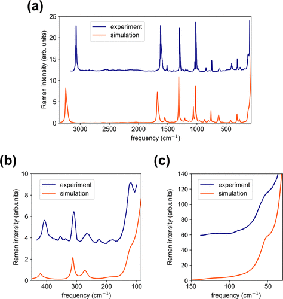
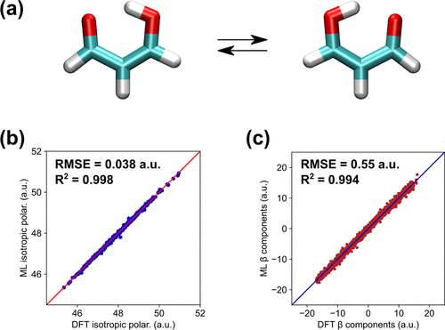

# A Bond-Based Machine Learning Model for Molecular Polarizabilities and A Priori Raman Spectra

## Why I chose this paper

- Reconstructing IR/Raman spectra is interesting to me
- Applications of ML to electronic structure theory (outside of potential) is cool

## Introduction

- Machine learning force fields (ML FF) have accelerated the field of molecular simulations – specifically for systems where there is not an established force field
- ML FFs are significantly more cost-efficient
- Learning molecular properties like dipole moment (IR) and polarizability (Raman) can help in interpreting spectra signals and benchmarking ML accuracy against experiment
- Neural network algorithms v.s. kernel algorithms
  - NN: better performance + lower cost for larger systems
  - kernel: requires less data + high cost for large systems

## Existing Work on ML Models for Electric Polarizability

- Equivariant neural networks, response formalism, Applequists's dipole interaction model
- Two kernel-based methods
  - align structures in training data and treat tensor components as scalars
    - requires lots of data
  - symmetry-adapted Gaussian regression
    - generalization of scalar kernel ridge regression (KRR)

### Goal of this work

- KRR on bond polarizability model (BPM)
  - molecular polarizability is a sum over bond contributions

## Theory

### Bond Polarizability Model

- total molecular polarizability, $\alpha$ is the sum of bond polarizabilities

$$
\alpha = \sum_b{\alpha^b}
$$

- elements of individual bond polarizability tensors

$$
\alpha_{ij}^{b} = \frac{1}{3}(2\alpha_p^b + \alpha_l^b)\delta_{ij} + (\alpha_l^b + \alpha_p^b)(\hat{R}_i^b\hat{R}_j^b - \frac{1}{3}\delta_{ij})
$$

- assumes bonds are cylindrically symmetric and typically assumes total polarizability only depends on bond length

## ML Model

- Separate polarizability tensor into isotropic and anisotropic components so the ML task is to infer these

$$
\alpha = \alpha_{\text{iso}}\bf{1}+\beta
$$

- Rewrite elements of tensor in terms of components

$$
\alpha_{ij}^{b} = \alpha_{\text{iso}}^b\delta_{ij} + \beta^b(\hat{R}_i^b\hat{R}_j^b - \frac{1}{3}\delta_{ij})
$$

- KRR used to evaluate isotropic component, summed over bonds instead of atoms

$$
\alpha_{\text{iso}} = \sum_b{\alpha_{\text{iso}}^b} = \sum_n{\sum{K(\textbf{q}^b},\textbf{q}^{b'})w_n}
$$

- Using a Gaussian kernel

$$
K(\textbf{q}^b,\textbf{q}^{b'}) = \text{exp}(-\gamma||\textbf{q}^b-\textbf{q}^{b'}||^2)
$$

- The same can be done for anisotropic component

$$
\beta_{ij} = \sum_b{\beta^bQ_{ij}^b} = \sum_n{\sum_{b,b'}{K(\textbf{q}^b},\textbf{q}^{b'})Q_{ij}^bv_n}
$$

- loss function

$$
\mathcal{L} = \frac{1}{2}\sum_{i,j}{||\beta_{ij} - \textbf{K}_{ij}\textbf{v}||^2}
$$

## Raman Spectra

- Calculating the anharmonic IR and Raman spectra

$$
I_{\text{iso}}(\omega) \propto v(\omega) \int{dt \ e^{i\omega t}\langle\dot{\alpha}_{\text{iso}}(\tau)\dot{\alpha}_{\text{iso}}(t-\tau)}\rangle_\tau
$$
$$
I_{\text{aniso}}(\omega) \propto v(\omega) \int{dt \ e^{i\omega t}\langle Tr[\dot{\beta}_{\text{iso}}(\tau)\dot{\beta}_{\text{iso}}(t-\tau)}]\rangle_\tau
$$

## Biphenyl

## Raman spectra evaluation

## Malonaldehyde

- keto and enol forms

## Future Directions

- Deep neural network implementation of BPM
- Consider all bonds within a cutoff region
