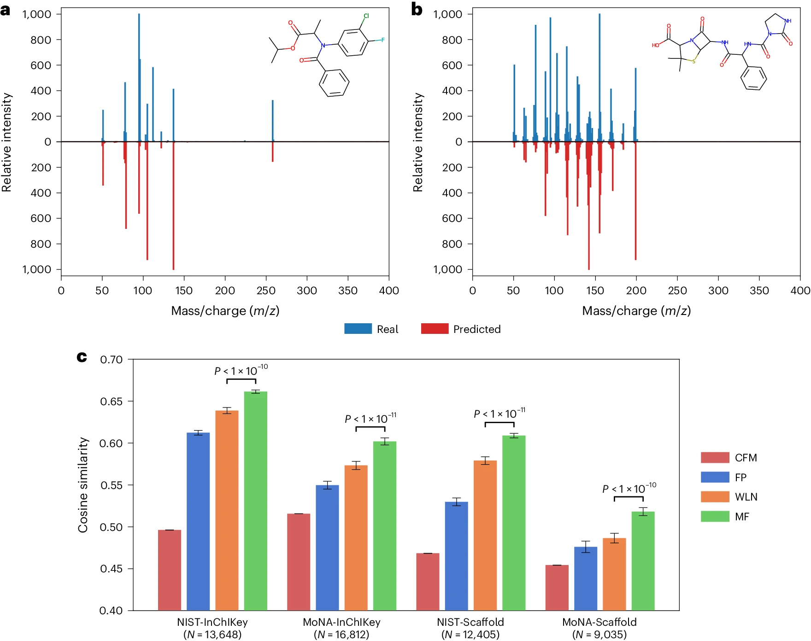
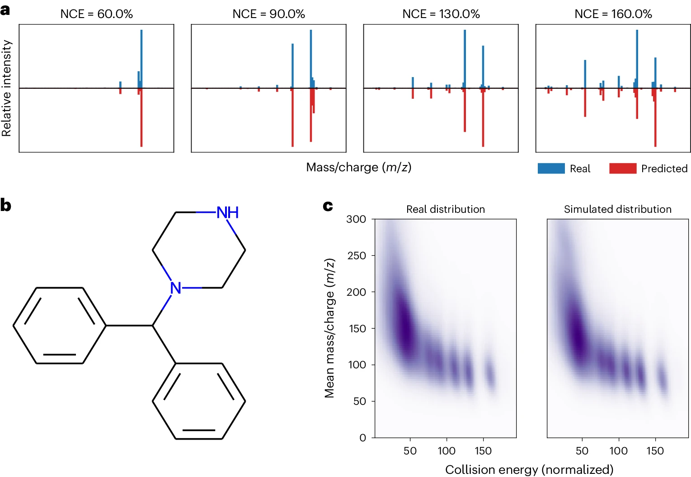
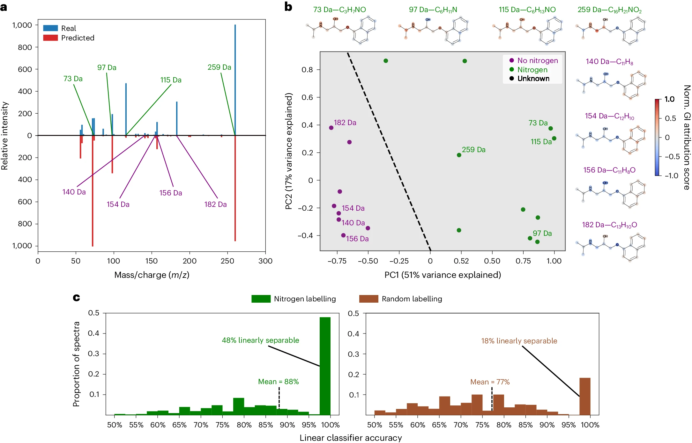

# Tandem mass spectrum prediction for small molecules using graph transformers

**Authors:** [Adamo Young](https://scholar.google.co.uk/citations?hl=en&user=Z6aqZBQAAAAJ&view_op=list_works&sortby=pubdate), [Hannes Röst](https://scholar.google.co.uk/citations?hl=en&user=6OThq9wAAAAJ) & [Bo Wang](https://orcid.org/0000-0002-9620-3413) 

**DOI:** [doi:10.1038/s42256-024-00816-8](https://doi.org/10.1038/s42256-024-00816-8)

**Published:** April 2024

**Journal:** [Nature Machine Intelligence](https://www.nature.com/natmachintell/)

## Why discuss this paper?
- I chose this article because, even after decades of work in the field, we still lack reference spectra, and the vast majority of small molecules lack experimental reference spectra, making the identification of new compounds a difficult task.
- It tackles with fundamental challenge in Mass Spectrometry (MS) - accurately simulating the fragmentation process.
- The results show promise for improved MS-based compound identification.

## Context

### Overview of Mass Spectrometry

```mermaid
%%{init: {"flowchart": {"htmlLabels": true}} }%%
flowchart LR;

Mass_Spectrometry_MS["<b>Mass Spectrometry (MS)</b>"]
Mass_Spectrometry_MS --> Identifies_quantifies_chemicals["Identifies and quantifies chemicals in a mixture"]
Mass_Spectrometry_MS --> Ionized_detected_mass_analyzer["Molecules are ionized and detected by mass analyzer"]
Mass_Spectrometry_MS --> Records_mass_charge_ratio["Records mass-to-charge ratio (m/z)"]

Tandem_MS_MS["<b>Tandem Mass Spectrometry (MS/MS)</b>"]
Tandem_MS_MS --> Includes_fragmentation_step["Includes fragmentation step"]
Tandem_MS_MS --> Breaks_down_molecules["Breaks down molecules into smaller fragments"]
Tandem_MS_MS --> Infers_molecular_structure["Infers molecular structure of original molecule"]

LC_MS_MS["<b>LC-MS/MS</b>"]
LC_MS_MS --> Combines_liquid_chromatography["Combines liquid chromatography for separation"]
LC_MS_MS --> Used_in_various_fields["Used in proteomics, metabolomics, forensics, environmental chemistry"]

Mass_Spectrometry_MS --> Tandem_MS_MS
Mass_Spectrometry_MS --> LC_MS_MS
```
### Challenges in Mass Spectrometry
```mermaid
%%{init: {"flowchart": {"htmlLabels": true}} }%%
flowchart LR;

Challenges_in_MS["<b>Challenges in MS</b>"]
Challenges_in_MS --> Accurate_simulation_difficult["Accurate simulation of fragmentation is difficult"]
Challenges_in_MS --> Simulations_slow_approximate["First principles simulations are slow and approximate"]
Challenges_in_MS --> Incomplete_spectral_databases["Incomplete spectral databases hinder compound identification"]
```
### Overview of Existing Solutions and Limitations
```mermaid
%%{init: {"flowchart": {"htmlLabels": true}} }%%
flowchart LR;

Existing_Solutions_Limitations["<b>Existing Solutions and Limitations</b>"]

Database_Searches["Database Searches"]
Database_Searches --> Rely_large_libraries["Rely on large reference libraries and spectrum similarity functions"]
Database_Searches --> Poor_coverage["Databases have poor coverage"]

In_Silico_Spectra["In Silico Spectra"]
In_Silico_Spectra --> Augments_libraries["Augments spectral libraries with simulated spectra"]
In_Silico_Spectra --> Improves_coverage_match["Improves coverage and match finding"]

Competitive_Fragmentation_Modelling["Competitive Fragmentation Modelling (CFM)"]
Competitive_Fragmentation_Modelling["Competitive Fragmentation Modelling (CFM)"] --> Combinatorial_fragmentation["Combines combinatorial fragmentation and probabilistic modeling"]
Competitive_Fragmentation_Modelling["Competitive Fragmentation Modelling (CFM)"] --> Slow_struggles_larger_compounds["Slow and struggles with larger compounds"]

Deep_Learning_Approaches["Deep Learning Approaches"]
Deep_Learning_Approaches --> Fully_connected_networks["Use fully connected neural networks or graph neural networks"]
Deep_Learning_Approaches --> Focus_local_structures["Focus on local structures"]
Deep_Learning_Approaches --> Struggle_global_interactions["Struggle with modeling global interactions"]

Existing_Solutions_Limitations --> Database_Searches
Existing_Solutions_Limitations --> In_Silico_Spectra
Existing_Solutions_Limitations --> Competitive_Fragmentation_Modelling
Existing_Solutions_Limitations --> Deep_Learning_Approaches
```
## Overview of MassFormer
```mermaid
%%{init: {"flowchart": {"htmlLabels": true}} }%%
flowchart LR;

Development_of_MassFormer["<b>Development of MassFormer</b>"]
Development_of_MassFormer --> Adapts_graph_transformer["Adapts graph transformer architecture for MS/MS spectrum prediction"]
Development_of_MassFormer --> Graph_transformers_model["Graph Transformers model pairwise interactions between all nodes"]
Development_of_MassFormer --> Captures_local_global["Captures both local and global structural information"]
Development_of_MassFormer --> Unique_Positional_Encoding["Unique Positional Encoding uses degree and shortest path information"]
```
### Overview of Steps involved in MassFormer

 

**Molecule to Spectrum**
- Unlike traditional methods, MassFormer utilizes a graph-based approach to represent molecules.
- Incorporating spectral metadata like collision energy used during the measurement. This additional information allows MassFormer to account for factors that might influence the fragmentation patterns observed in the final spectrum prediction.
- Multihead self-attention : MHA - allows an input to attend to relevant parts of itself
- Multilayer perceptrons : MLPs - capture non-linear relationships between the resulting representation and the final output.

## Results

 

**Spectrum similarity experiments: Predicted vs Real spectra for two held out compound (Azlocillin and Flamprop-isopropyl)**
- Accurate Predictions: MassFormer can predict realistic mass spectra for held out compounds. The high cosine similarity values (around 0.6) indicate a close match between the predicted and actual spectra.
- Outperforms Existing Models: When compared to other deep learning models (CFM, FP, WLN) on a larger dataset, MassFormer consistently performs better. It shows the highest average cosine similarity across different data splits.
- NIST: National Institute of Standards and Technology
- MoNA: MassBank of North America
- FP: Fingerprint (FP) neural network model
- WLN: Weisfeiler–Lehman (WLN) graph neural network model

 

**Collision energy experiments: benzhydrylpiperazine**
- MassFormer can not only predict mass spectra accurately but also captures the influence of collision energy on the fragmentation patterns observed in the spectra.
- This ability is important for real-world applications where collision energy is a variable factor during data acquisition. 
- NCEs: Normalized collision energies

 

**Explainability using gradient attributions: Mass spectrum of propranolol**
- Separation of Nitrogen-Containing Peaks:The gradient attribution maps reveal that nitrogen-containing peaks can be linearly separated from those without nitrogen, demonstrating that the model captures meaningful chemical information related to nitrogen content.
- Improved Classification Accuracy: The linear classification accuracy is significantly higher when using nitrogen labeling compared to random labeling, with nearly half of the peaks being perfectly separable based on their gradient attributions, highlighting the effectiveness of the attributions in distinguishing chemical compositions.

## Advantages of MassFormer
```mermaid
%%{init: {"flowchart": {"htmlLabels": true}} }%%
flowchart LR;

Advantages_of_MassFormer["<b>Advantages of MassFormer</b>"]

Accurate_Predictions["Accurate Predictions"]
Accurate_Predictions --> State_of_the_art["State-of-the-art performance in spectrum prediction"]
Accurate_Predictions --> Outperforms_existing_methods["Outperforms existing baseline methods"]

Global_Interactions["Global Interactions"]
Global_Interactions --> Models_global_interactions["Models global interactions between distant atoms"]
Global_Interactions --> Improves_understanding["Improves understanding of fragmentation events"]

Efficiency["Efficiency"]
Efficiency --> Leverages_pretrained_models["Leverages pretrained graph transformer models"]
Efficiency --> Accurate_predictions["Provides accurate predictions without excessive computational costs"]

Real_World_Applications["Real-World Applications"]
Real_World_Applications --> Validated_spectrum_identification["Validated for spectrum identification problems"]
Real_World_Applications --> Handles_collision_energy["Handles effects of collision energy on spectra"]

Advantages_of_MassFormer --> Accurate_Predictions
Advantages_of_MassFormer --> Global_Interactions
Advantages_of_MassFormer --> Efficiency
Advantages_of_MassFormer --> Real_World_Applications
```
## Takeaways

- The current study introduces MassFormer, a novel method utilizing graph transformers for small molecule MS/MS spectra prediction.
- While demonstrating strong performance, MassFormer's applicability is currently limited by data type compatibility. (limitations)
- The model offers explainability for its predictions; however, further development is required for detailed peak annotations. (Need for improvement)
- MassFormer holds significant promise for MS-based compound identification, potentially enhancing existing tools and even aiding spectrum-to-structure generation. (Focuses on future potential and broader applications) 

## Data availability

All public data from the study have been uploaded to Zenodo at https://doi.org/10.5281/zenodo.8399738. Some data that support the findings of this study are available from the National Institute of Standards and Technology (NIST). However, its access is subject to restrictions, requiring the purchase of an appropriate license or special permission from NIST.

## Code availability

The code used in this study is open-source (BSD-2-Clause license) and can be found in a GitHub repository (https://github.com/Roestlab/massformer/) with a DOI of https://doi.org/10.5281/zenodo.10558852.

## References

[references_MassFormer.bib](references_MassFormer.bib)
