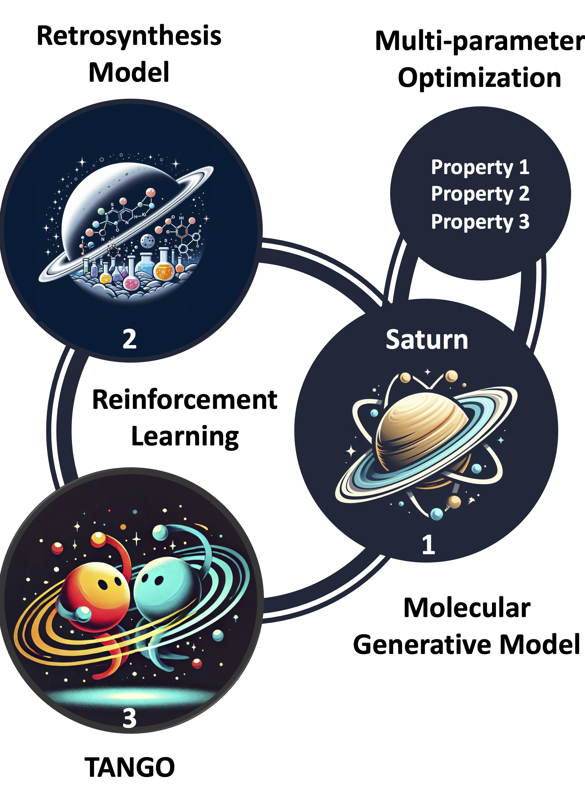
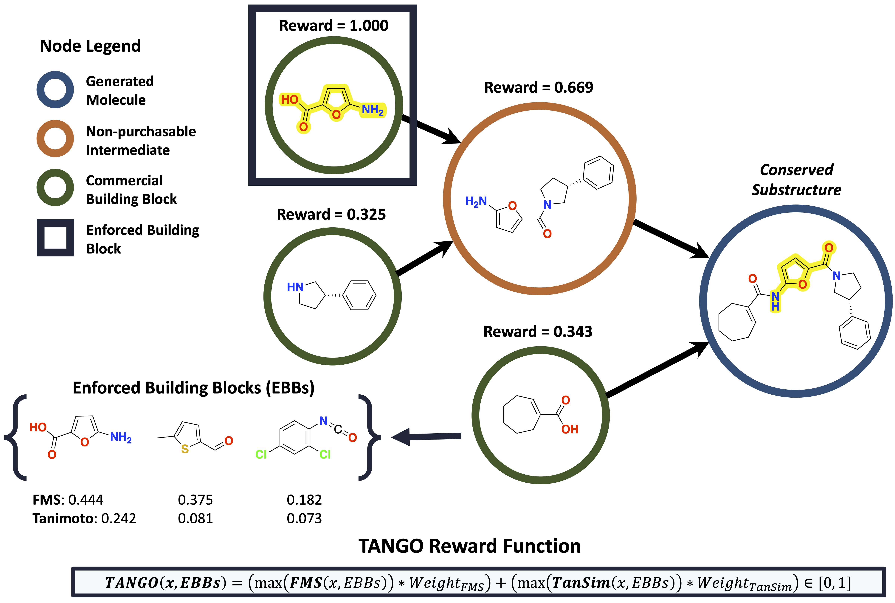
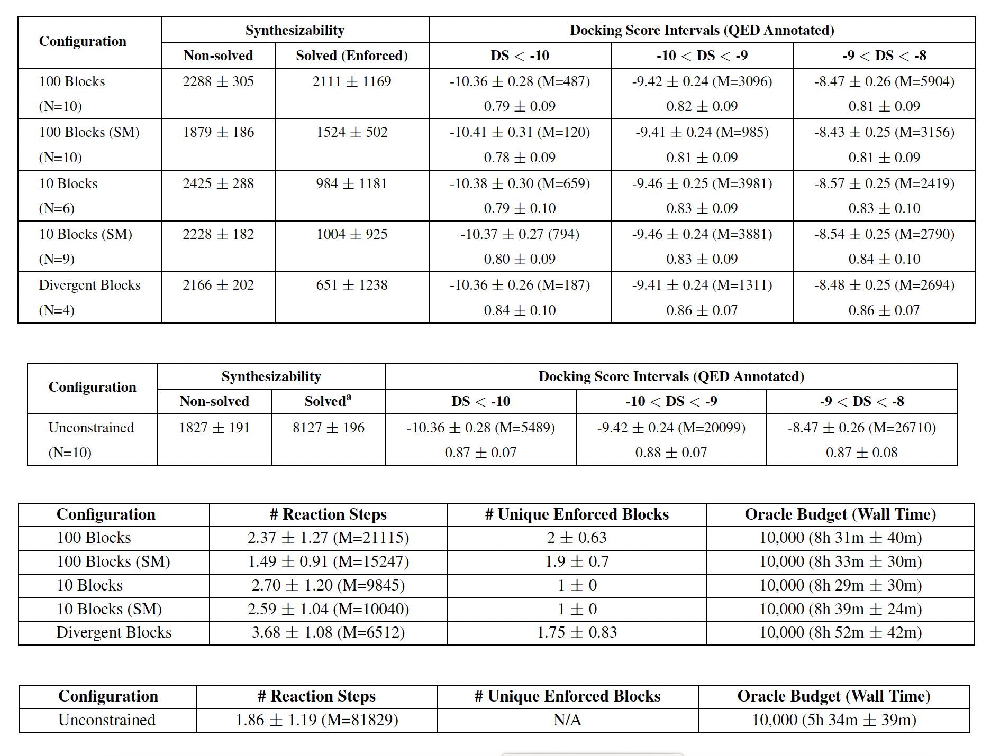
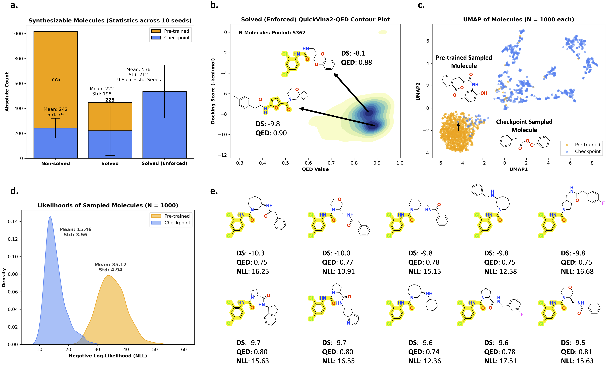

# It Takes Two to Tango: Directly Optimizing for Constrained Synthesizability in Generative Molecular Design [@https://doi.org/10.48550/arxiv.2410.11527]

## Why did I choose this paper?

- From a chemist point of view prediction of synthesis paths is really relevant.
- From a ML perspective they are still a lot of challenges.

## Context

Predicting synthesis path of complex organic molecules whit multiple intermediates is challenging. This task gets even more complex if the products are constrained to e.g. commercially available products.

## Prior work

**Stabilizability constrained molecular generation**: Enforcing valid chemical transformations

- **"SynNet Gao et al.** [@https://doi.org/10.48550/arXiv.2410.03494]:
  - Uses a Markov decision process to generate molecules and synthesis pathways simultaneously through a bottom-up tree model
  - utilizes reactive templates and commercial starting materials for synthesizabilit.
  - Focuses primarily on synthesis tree generation without a broad multi-parameter optimization (MPO) approach 

- **SynFormer Gao et al.** [@https://doi.org/10.48550/arxiv.2410.03494]:
  - generative framework that uses a scalable transformer architecture and a diffusion model to navigate synthesizable chemical space
  - generates synthetic pathways by linking commercially available building blocks through known reactions, ensuring synthetic accessibility
  - focuses on generating pathways within a defined synthesizable space, emphasizing chemical space exploration and pathway reconstruction

## Main contributions

- general-purpose molecular generative model that generates synthesize molecules
- TANimoto Group Overlap (TANGO) reward function for the generation of synthesizable molecules with the presence of enforced building blocks
- generated molecules can satisfy multi-parameter-optimization (MPO) objects relevant to drug discovery

## Structure of the overall pipeline

- [Saturn](https://github.com/schwallergroup/saturn) model as molecular generative model: 
  - based on [Mamba](https://github.com/state-spaces/mamba) a lightweight, autoregressive model for the sequential prediction of SMILES
  - pretrained on PubChem
- Fine-tuning with a reinforcement-learning-setup:
  - TANGO reward function to measure for similarity of generated molecules and enforced building blocks
  - [Syntheseus](https://github.com/microsoft/syntheseus) as retro-synthesis tool to check if molecules are synthesizable
  - MPO for docking-score (biological effectiveness) and QED score (Quantitative Estimate of Drug-likeness)

## Problem formulation

### Case 1: Starting material constrained

A synthesis graph G(M, R) is starting-material constrained if there exists at least one leaf node $$ m \in G(M, R) $$ that meets both conditions:
$$ m = b \in B_{enf} $$
$$ \text{depth}(m) = \max \text{depth} $$ 

$$
\exists m \in G(M, R) \; \text{such that} \; \text{depth}(m) = \max \; \text{depth and} \; m = b \in B_{enf}
$$

- requires at least one terminal node (leaf) in the synthesis route to correspond to a specified starting material
- useful for ensuring the synthesis begins with commercially available or cost-effective starting reagents

---

### Case 2: Intermediate Constrained Synthesis

**Mathematical Definition:**  
A synthesis graph G(M, R) is intermediate constrained if there exists at least one intermediate node $$ m \in G(M, R) $$ that belongs to the enforced building blocks $$ B_{enf} $$.

$$
\exists m \in G(M, R) \; \text{such that} \; m \in B_{enf}
$$

- allows for one or more intermediate steps in the synthesis to include specified building blocks
- enables designing synthetic pathways that feature important building blocks at intermediate stages

---

### Case 3: Divergent Synthesis

A synthesis graph G(M, R) is divergent if there exists at least one intermediate node $$ m \in G(M, R) $$ that meets the following conditions:
$$ m = b \in B_{enf} $$
All $$ b \in B_{enf} $$ are non-commercial.

$$
\exists m \in G(M, R) \; \text{such that} \; \forall b \in B_{enf}, \; b \; \text{is non-commercial and} \; m = b \in B_{enf}
$$

- requires that an intermediate node in the synthesis graph matches a non-commercial building block, allowing it to diverge into multiple branches
- suitable for late-stage functionalization, often required to generate diverse molecular structures in drug discovery

## TANGO Reward Function

- **Tanimoto Similarity**: 
  - Metric used to quantify the similarity between two molecular structures.
  - Calculated based on the overlap of molecular fingerprints, with values ranging from 0 (no similarity) to 1 (perfect similarity).

- **Fuzzy Matching Substructure (FMS)**: 
  - Measures the maximum overlap between substructures of a generated molecule.
  - Takes into account atom types, hybridization, and bonding patterns.
  - Designed to capture functional groups and conserved structures.

The TANGO reward for a molecule m in a synthesis graph G(M, R) is calculated as the weighted sum of the Tanimoto similarity (TanSim) and Fuzzy Matching Substructure (FMS) similarity to the enforced building blocks $$ B_{enf} $$.

$$
\text{TANGO}(m, B_{enf}) = \left( \max(\text{TanSim}(m, B_{enf})) \times 0.5 \right) + \left( \max(\text{FMS}(m, B_{enf})) \times 0.5 \right) \in [0, 1]
$$

- Calculates the reward based on the maximum similarity between each non-root node in the synthesis graph and the enforced building blocks.
- The reward is normalized within the range [0, 1] and helps the model learn to generate molecules closer to the desired structural and functional goals.

## Experimental setting

- **Molecular Generative Model**: used model: Saturn (autoregressive SMILES-based model leveraging the Mamba architecture) 

- **Retrosynthesis Model**: Syntheseus (framework supporting various retrosynthesis algorithms) with MEGAN as the single-step retrosynthesis model, Retro* as search algorithm

- **Set of Commercial Building Blocks**: includes fragments and reactive compounds from the ZINC database

- **Drug Discovery Case Study**: focuses on generating molecules with optimal docking scores against ClpP (cancer-related protease target), high QED (drug-likeness) values 

- **Experimental Details**: oracle budget (maximum number of evaluations of a molecule) of 10,000 steps and evaluation across multiple seeds 

- **Metrics**:
  - **Non-solved**: count of generated molecules that the retrosynthesis model deems unsynthesizable 

  - **Solved (Enforced)**: count of generated molecules that the retrosynthesis model deems synthesizable and include at least one enforced building block

  - **N (Replicates)**: number of successful replicates (out of 10 seeds) in which at least one Solved (Enforced) molecule is generated

  - **Unique Enforced Blocks**: average and standard deviation of unique enforced building blocks in the synthesis routes for Solved (Enforced) molecules

  - **Reaction Steps**: average and standard deviation of the number of reaction steps in synthesis routes for Solved (Enforced) molecules

  - Docking Score and QED 
  
## Results

### Synthesizibility constrained molecules generation

- different configurations: with 10 and 100 enforced building blocks,  diffenrent constrains (SM, divergent and unconstrained)
- Metrics:
  - Synthesisablity: Non-solved and Solved (enforced)
  - mean value for differnet docking score intervals (lower number are better)
  - number of molecules in the docking score interval M
  - mean QED values for every docking score interval (higher values are better)
  - mean number of reactions steps
  - mean number of enforced building blocks used in synthesis routs of synthesizible molecules

- comparison to other models because of new metrics hard and not shown by the authors
- TANGO reward function archives highest scores compared to only Tanimoto similarity or Fuzzy matching substructures
- equal weighting (0.5) of Tanimoto similarity and FMS in the TANGO reward function shows the best performance
- more consistent and stable outcomes across different seeds compared to other reward configurations

### Learning a desirable distribution

Comparison of pre-trained model to final checkpoint of fine-tuned model (mean over 10 seeds over 1000 randomly sampled molecules)

- **Distribution Shift with TANGO**: enables a shift in the model’s distribution towards generating molecules that meet MPO objectives
  - significant increase in **Solved (Enforced)** molecules, indicating the model’s successful learning of constrained synthesizability
  - distribution of docking scores and QED values showed a shift towards favorable ranges
  - model learned to focus on a narrower, more optimized chemical space

- **Exploitation Advantage**: model benefits from exploiting certain favorable enforced building blocks which promotes local exploration, allowing the generation of structurally related but optimized molecules

## Conclusion 

- **Effectiveness of TANGO**: The TANGO reward function enables the Saturn model to learn constrained synthesizability effectively, balancing both synthesizability and structural similarity requirements.

- **Multi-Parameter Optimization**: TANGO facilitates multi-parameter optimization (MPO), allowing the generation of molecules that meet complex objectives, including optimal docking scores, high QED values, and the inclusion of enforced building blocks.

- **Improved Synthesizability**: Compared to previous methods, TANGO demonstrates a higher success rate in generating synthesizable molecules, particularly with constrained conditions.

- **Computational Efficiency**: The method is computationally efficient, achieving high performance within a limited Oracle budget, making it practical for large-scale molecular generation tasks.

- **Potential in Drug Discovery**: The approach provides a promising framework for generating drug-like molecules with specific requirements, potentially accelerating the early stages of drug discovery and development.

## Personal opinion

- shown method and functions are easy to understand 
- missing comparison with other models to prove improvement of scores with new method
  
## References

